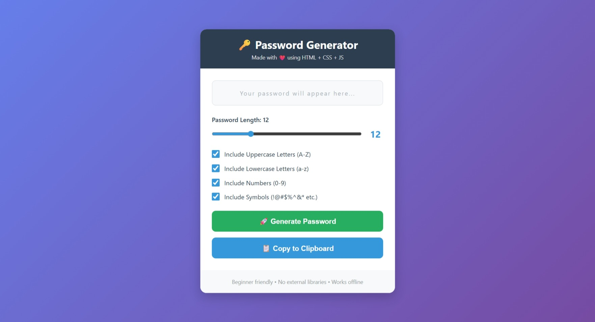

# 🔑 Password Generator

A clean, modern, and beginner-friendly password generator built with pure HTML, CSS, and JavaScript. No frameworks, no external libraries — just vanilla web technologies!




---

## ✨ Features

- **Customizable Length:** Adjustable password length (6–30 characters).
- **Character Control:** Toggle uppercase, lowercase, numbers, and symbols.
- **Smart Generation:** Guarantees at least one character from each selected category to ensure true randomness and security.
- **Visual Feedback:** Live password strength indicator with color-coded bars.
- **UX/UI Touches:** One-click copy to clipboard with visual confirmation and keyboard support (Press **Enter** to generate).
- **Responsive & Offline:** Fully responsive design that works completely offline.

---

## 🚀 Live Demo

[View Live Demo](https://Umesh358.github.io/Password-Generator)

---

## 🧠 What I Learned

Building this project helped reinforce core frontend concepts, specifically:
* **DOM Manipulation:** Capturing user inputs from range sliders and checkboxes to dynamically update the UI.
* **Event Handling:** Triggering functions via button clicks, slider inputs, and keyboard events (`Enter` key).
* **Array & String Methods:** Utilizing `Math.random()`, `.split()`, `.sort()`, and `.join()` to shuffle characters and generate secure strings.
* **CSS Flexbox:** Structuring a clean, responsive layout using modern CSS properties like `gap` and CSS variables for consistent theming.

---

## 📂 Project Structure

```text
password-generator/
├── index.html
├── styles.css
├── script.js
└── README.md
```

---

## 🧪 How to Use Locally
1. **Clone the repository:**
```
   git clone [https://github.com/Umesh358/Password-Generator.git](https://github.com/Umesh358/Password-Generator.git)
   ```

2. **Open the project:** Open index.html in your browser (double-click or use an extension like VS Code Live Server).

3. **Generate:** Adjust your settings and click **Generate Password** 🚀

---

## 👤 Author

- **Umesh Sharma** - [GitHub](https://github.com/Umesh358)

- **LinkedIn** - [Click Me](www.linkedin.com/in/umesh-sharma-10a465382)

---

## 📄 License

This project is open-source and available under the [MIT License](https://github.com/Umesh358/Password-Generator/blob/main/LICENSE).
